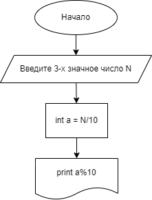

## Homework
- Homework_001
#### Напишите программу, которая принимает на вход трёхзначное число и на выходе показывает вторую цифру этого числа.

456 -> 5

782 -> 8

918 -> 1

Декомпозиция задачи:

1. Принимаем данные от пользователя.
2. Находим вторую цифру.
3. Выводим результат. 

[КОД](Homework_001/program.cs)