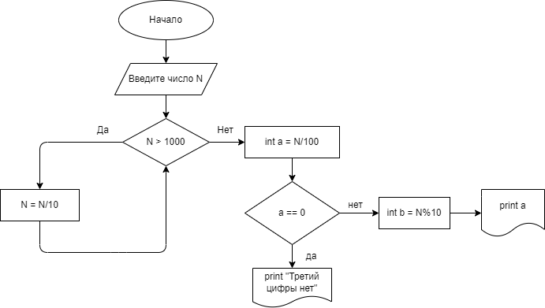

## Homework
- Homework_001
#### Напишите программу, которая принимает на вход трёхзначное число и на выходе показывает вторую цифру этого числа.

456 -> 5

782 -> 8

918 -> 1

Декомпозиция задачи:

1. Принимаем данные от пользователя.
2. Находим вторую цифру.
3. Выводим результат. 

![Блок-схема][def]

[КОД](Homework_001/program.cs)

 - Homework_002

####  Напишите программу, которая выводит третью цифру заданного числа или сообщает, что третьей цифры нет.

645 -> 5

78 -> третьей цифры нет

32679 -> 6

Декомпозиция задачи:

1. Принимаем данные от пользователя.
2. Составляем метод проверки есть ли 3 число.
3. Выводим результат. 

[КОД](Homework_002/program.cs)

[def]: Homework_001/diagram.drawio.png